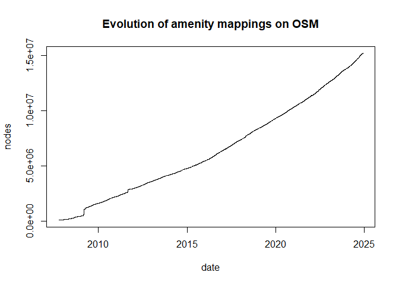
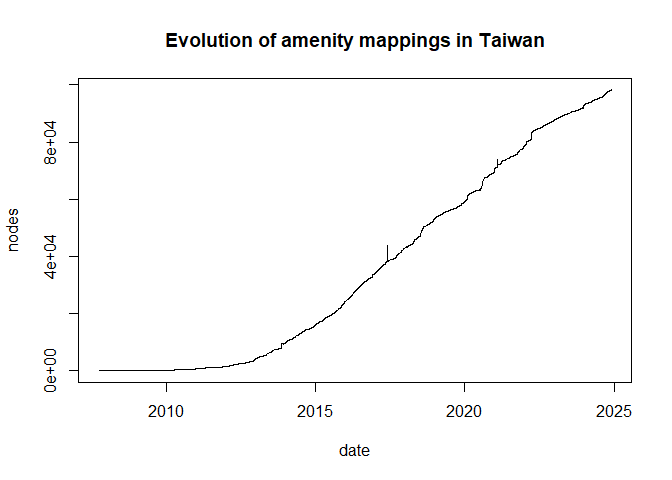

<!-- README.md is generated from README.Rmd. Please edit that file -->

# osmtags

<!-- badges: start -->

[](https://github.com/JsLth/osmtags/actions/workflows/R-CMD-check.yaml)
<!-- badges: end -->

Get statistics on OpenStreetMap tags using the
[taginfo](https://taginfo.openstreetmap.org/) API.

## Installation

You can install the development version of osmtags like so:

``` r
pak::pkg_install("jslth/osmtags")
```

## Example

OSM tag data comes in pretty dataframes/tibbles that are easy to work
with.

``` r
library(osmtags)

history <- key_chronology("amenity")
history$nodes <- cumsum(history$nodes)
with(history, plot(date, nodes, type = "l", main = "Evolution of amenity mappings on OSM"))
```



The default taginfo API can easily be swapped, e.g. to include only tags
in Taiwan:

``` r
taginfo_instances("taiwan")
#> # A tibble: 2 × 4
#>   type      name        description url                                     
#>   <chr>     <chr>       <chr>       <chr>                                   
#> 1 wiki      taiwan      Taiwan      https://taginfo.osm.kcwu.csie.org       
#> 2 geofabrik asia:taiwan Taiwan      https://taginfo.geofabrik.de/asia:taiwan
```

``` r
set_taginfo_url("asia:taiwan")
history <- key_chronology("amenity")
history$nodes <- cumsum(history$nodes)
with(history, plot(date, nodes, type = "l", main = "Evolution of amenity mappings in Taiwan"))
```


